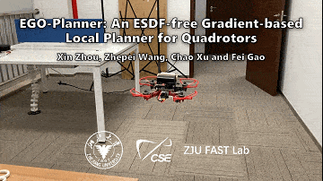
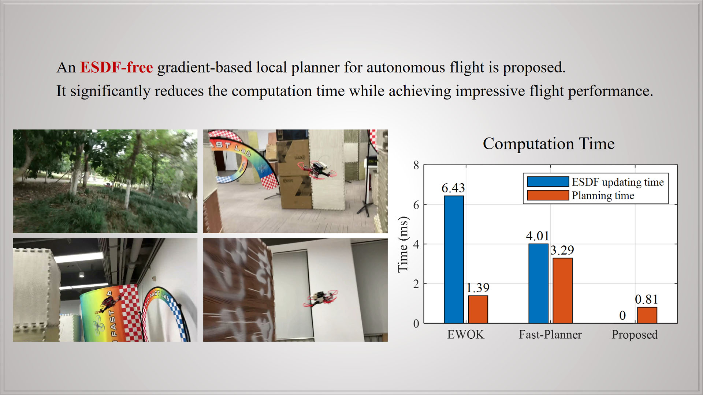
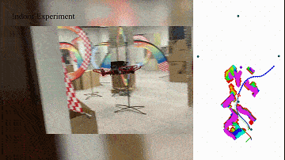
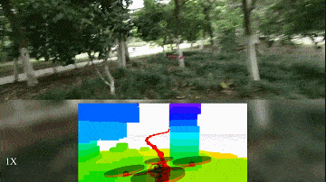
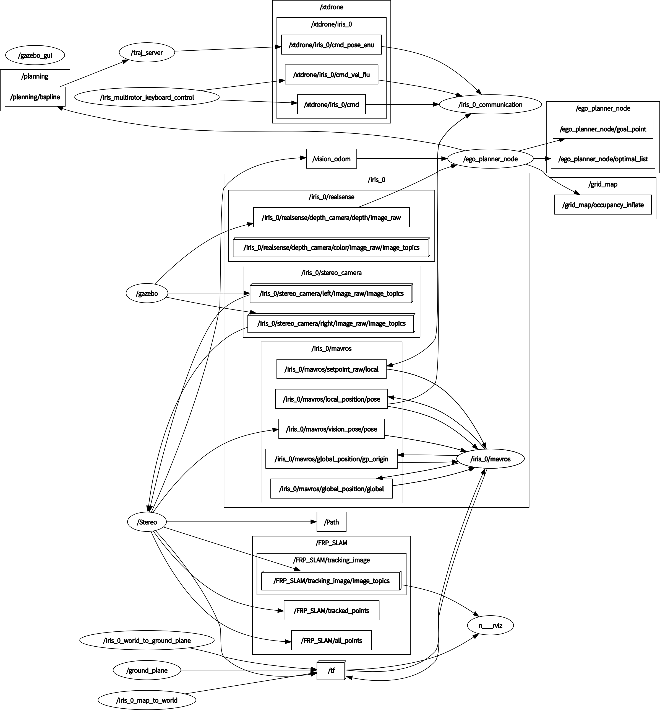
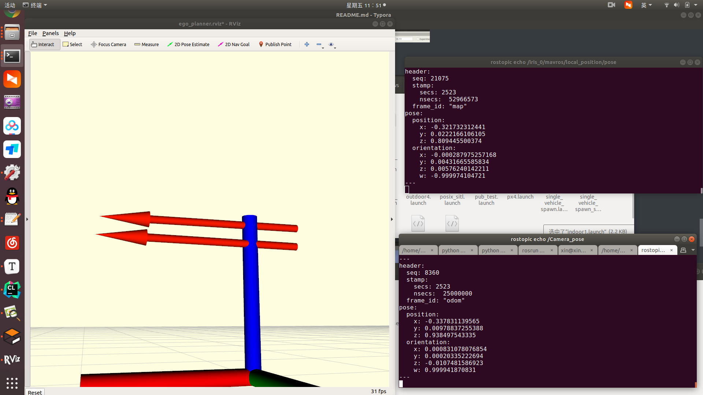
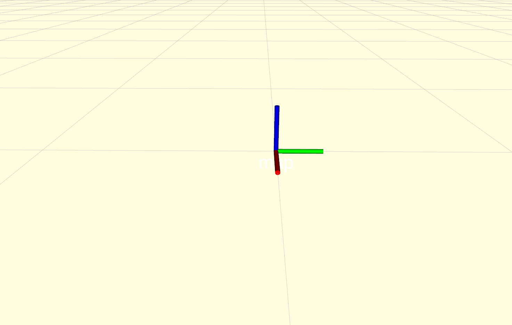
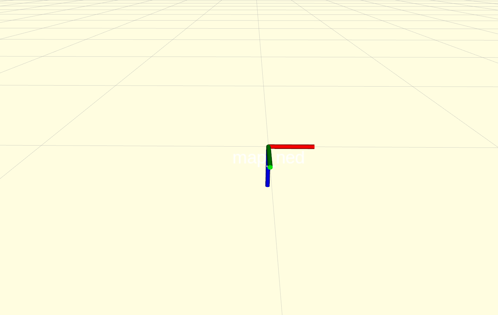
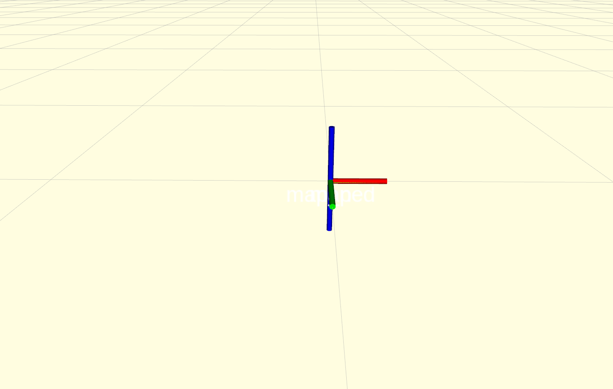
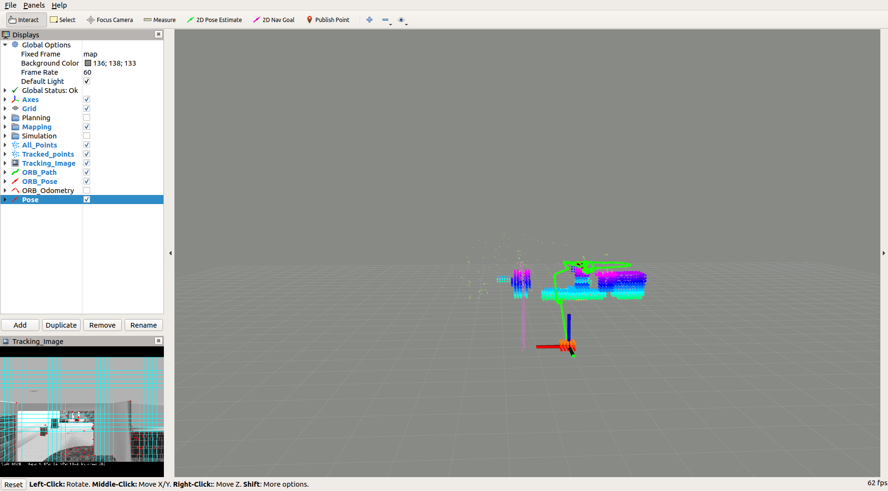

#                                     **无人机定位与自主导航**


1.使用改进过的ORB_SLAM3定位，实现GPU加速，与原算法相比速度更快，鲁棒性更强，精度更高。与原算法相比各部分提升性能如下表所示

```shell

+-----------------------------+----------------------+---------------------+-----------------------------+-----------------------------+
| | pc Without CUDA (ms) | pc With CUDA (ms)   | Jetson NX Without CUDA (ms) | Jetson NX with CUDA (ms)    |
+-----------------------------+----------------------+---------------------+-----------------------------+-----------------------------+
| ORB Extraction              | 23.34244±4.96281     | 1.61836       | 50.62526±5.86117            | 10                                   |
| Stereo Matching            | 5.72343±0.97511      | 2.34062        | 13.28446±1.98780            | 2.47                               |
| Pose Prediction             | 3.58646±1.62789      |                         | 8.82931±3.17531               | [待测]                           |
| LM Track                           | 7.14140±6.77893      |                         | 18.01320±11.69190          | [待测]                           |
| New KF decision           | 0.44474±2.24553      |                         | 1.42868±4.59653                | [待测]                          |
| Total Tracking                | 44.86070±11.98428    | 4.72937     | 100.92199±19.73700         |  33                                |
+-----------------------------+----------------------+---------------------+-----------------------------+-----------------------------+
 pc端与jetson nx上处理速度都有较大提升，且精度不降。
 
#1. 目前只测试双目模式，后续测试rgbd模式以及双目VIO模式。
#2. 关闭所有可视化窗口，所有信息都可以通过rviz查看。
#3. 与原始算法对比如下视频所示。
```

GPU加速提取特征点

<video controls width="1080">     <source src="pictures/FasterExtractORB.mp4" type="video/mp4">     Your browser does not support the video tag. </video>

------


## 1. Px4环境搭建 — ubuntu18.04 + PX4_Firmware 1.13

### 1.安装ros-melodic，按照之前流程

```
sudo apt install ros-melodic-desktop-full
```

#或者可以选择不安装gazebo

```
sudo apt install ros-melodic-desktop
```

### 2.完全卸载gazebo9，安装gazebo-11

```
sudo apt-get remove ros-melodic-gazebo* 

sudo apt-get remove ros-melodic-gazebo9* 

sudo apt remove --purge gazebo*

sudo apt remove --purge gazebo9*

sudo apt remove libgazebo9*

sudo apt remove libgazebo*
```

### 3.安装依赖

```
sudo apt install ninja-build exiftool ninja-build protobuf-compiler libeigen3-dev genromfs xmlstarlet libgstreamer1.0-dev libgstreamer-plugins-base1.0-dev python-pip python3-pip gawk

pip2 install pandas jinja2 pyserial cerberus pyulog==0.7.0 numpy toml pyquaternion empy pyyaml 
pip3 install packaging numpy empy toml pyyaml jinja2 pyargparse kconfiglib jsonschema future
```

### 4.安装gazebo-11

1. Setup your computer to accept software from packages.osrfoundation.org.

   ```
   sudo sh -c 'echo "deb http://packages.osrfoundation.org/gazebo/ubuntu-stable `lsb_release -cs` main" > /etc/apt/sources.list.d/gazebo-stable.list'
   ```

2. Setup keys

   ```
   wget https://packages.osrfoundation.org/gazebo.key -O - | sudo apt-key add -
   ```

   

3. Install Gazebo.

   ```
   sudo apt-get update
   sudo apt-get install gazebo11
   # For developers that work on top of Gazebo, one extra package
   sudo apt-get install libgazebo11-dev
   ```

4. Check your installation

   ```
   gazebo
   ```

   

5. install gazebo-ros

   ```
   sudo apt-get install ros-melodic-moveit-msgs ros-melodic-object-recognition-msgs ros-melodic-octomap-msgs ros-melodic-camera-info-manager  ros-melodic-control-toolbox ros-melodic-polled-camera ros-melodic-controller-manager ros-melodic-transmission-interface ros-melodic-joint-limits-interfac
   ```

   ```
   cd ~/catkin_ws/src
   git clone -b melodic-devel https://github.com/ros-simulation/gazebo_ros_pkgs.git
   cd ~/catkin_ws
   catkin build
   ```

 6. test gazebo-ros

    ```
    roscore
    source ~/catkin_ws/devel/setup.bash
    rosrun gazebo_ros gazebo
    ```

### 5.安装MAVROS

```
sudo apt install ros-melodic-mavros ros-melodic-mavros-extras 		# for ros-melodic
wget https://gitee.com/robin_shaun/XTDrone/raw/master/sitl_config/mavros/install_geographiclib_datasets.sh

sudo chmod a+x ./install_geographiclib_datasets.sh
sudo ./install_geographiclib_datasets.sh #这步需要装一段时间
```

### 6.PX4配置

```
git clone https://github.com/PX4/PX4-Autopilot.git
mv PX4-Autopilot PX4_Firmware
cd PX4_Firmware
git checkout -b xtdrone/dev v1.13.2
git submodule update --init --recursive
make px4_sitl_default gazebo
```

增加环境变量

```
source ~/catkin_ws/devel/setup.bash
source ~/PX4_Firmware/Tools/setup_gazebo.bash ~/PX4_Firmware/ ~/PX4_Firmware/build/px4_sitl_default
export ROS_PACKAGE_PATH=$ROS_PACKAGE_PATH:~/PX4_Firmware
export ROS_PACKAGE_PATH=$ROS_PACKAGE_PATH:~/PX4_Firmware/Tools/sitl_gazebo
```

测试

```
cd ~/PX4_Firmware
roslaunch px4 mavros_posix_sitl.launch
#检查与mavros通信
rostopic echo /mavros/state
```

### 7.XTDrone源码下载

```
git clone https://gitee.com/robin_shaun/XTDrone.git
cd XTDrone
git checkout 1_13_2
git submodule update --init --recursive
# 修改启动脚本文件
cp sitl_config/init.d-posix/* ~/PX4_Firmware/ROMFS/px4fmu_common/init.d-posix/
# 添加launch文件
cp -r sitl_config/launch/* ~/PX4_Firmware/launch/
# 添加世界文件
cp sitl_config/worlds/* ~/PX4_Firmware/Tools/sitl_gazebo/worlds/
# 修改部分插件
cp sitl_config/gazebo_plugin/gimbal_controller/gazebo_gimbal_controller_plugin.cpp ~/PX4_Firmware/Tools/sitl_gazebo/src
cp sitl_config/gazebo_plugin/gimbal_controller/gazebo_gimbal_controller_plugin.hh ~/PX4_Firmware/Tools/sitl_gazebo/include
cp sitl_config/gazebo_plugin/wind_plugin/gazebo_ros_wind_plugin_xtdrone.cpp ~/PX4_Firmware/Tools/sitl_gazebo/src
cp sitl_config/gazebo_plugin/wind_plugin/gazebo_ros_wind_plugin_xtdrone.h ~/PX4_Firmware/Tools/sitl_gazebo/include

# 修改CMakeLists.txt
cp sitl_config/CMakeLists.txt ~/PX4_Firmware/Tools/sitl_gazebo
# 修改部分模型文件
cp -r sitl_config/models/* ~/PX4_Firmware/Tools/sitl_gazebo/models/ 
# 替换同名文件
cd ~/.gazebo/models/
rm -r stereo_camera/ 3d_lidar/ 3d_gpu_lidar/ hokuyo_lidar/
```

再次编译

```
cd ~/PX4_Firmware
make px4_sitl_default gazebo
```

用键盘控制无人机

```
#terminal1
cd ~/PX4_Firmware
roslaunch px4 indoor1.launch
#terminal2
cd ~/XTDrone/communication/
python multirotor_communication.py iris 0
#terminal3
cd ~/XTDrone/communication/
python multirotor_communication.py iris 0
```

------


## 2.EGO-Planner

```
sudo apt-get install libarmadillo-dev
git clone https://github.com/ZJU-FAST-Lab/ego-planner.git
cd ego-planner
catkin_make
source devel/setup.bash
roslaunch ego_planner simple_run.launch
```

<p align = "center">




</p>


------


## 3.FRP_SLAM+PX4+EGO-Planner

### 1.双目相机进行定位，深度图做感知，ego-planner做规划

<video controls width="1000">     <source src="pictures/nav.mp4" type="video/mp4">     Your browser does not support the video tag. </video>

### 2.节点关系

<p align = "center">

</p>
### 3.SLAM定位与真值对比

<p align = "center">

</p>
### 4.坐标系对比

在ENU坐标系中：

- **东（East）** 是 x 轴的正方向，指向东方。
- **北（North）** 是 y 轴的正方向，指向北方。
- **天（Up）** 是 z 轴的正方向，指向上方。

在NED坐标系中，正好相反：

- **北（North）** 是 x 轴的正方向，指向北方。
- **东（East）** 是 y 轴的正方向，指向东方。
- **地（Down）** 是 z 轴的正方向，指向地面。


<p align = "center">




</p>


手动pub目标点  2D nav

```
 rostopic pub /move_base_simple/goal geometry_msgs/PoseStamped "header:
  seq: 0
  stamp:
    secs: 0
    nsecs: 0
  frame_id: 'map'
pose:
  position:
    x: 0.1493370071054  # 替换成你想要的X坐标
    y: -10.870341491699  # 替换成你想要的Y坐标
    z: 1.05488955975
  orientation:
    x: 0.000467390511628
    y: -0.00885925142265
    z: 0.0222276578488
    w: -0.999698717213" -r 10
```

------


## 4.待解决问题

```shell
#1.坐标系问题 
需不需要使用机体坐标系
#2.定位鲁棒性问题
考虑使用双目VIO，特征很少情况下也能稳定跟踪
#3.VIO坐标系问题
如何给定正确的tf变换
#4.ego-planner的参数调优
#5.里程计话题中的线速度和角速度值对规划和导航的影响
#6.最大速度和最大加速度的设置
#6.深度图优化
```
